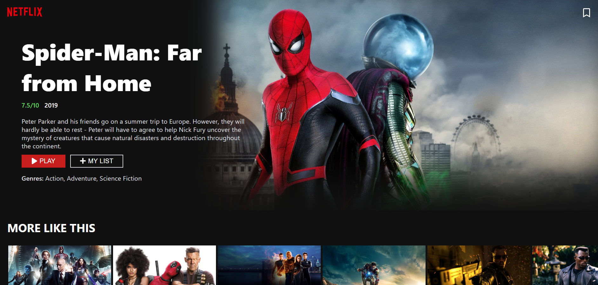

## Netflix Clone

Netflix Clone built with ReactJS and TheMovieDB API.

View the demo [https://netflix-clone.rajasha.dev](https://netflix-clone.rajasha.dev).

## Features

 - Display movies and tv shows using themoviedb API
 - Display Banner with random movies everytime we refresh
 - Scrollable rows of movies for different categories like Action, Comedy etc
 - Show movie trailer from Youtube on clicking Play button
 - Display "More Like This" and Casts for different movies
 - Bookmark movies by adding/removing from "My List"

## How to run

To install dependencies:

`npm install`

To start project:

`npm start`

Open browser and go to:

`localhost:3000`
